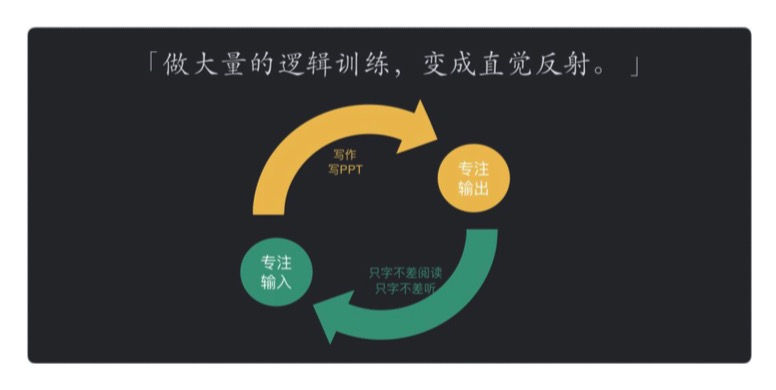
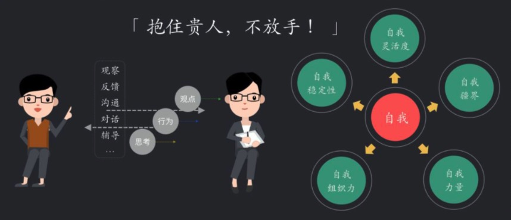
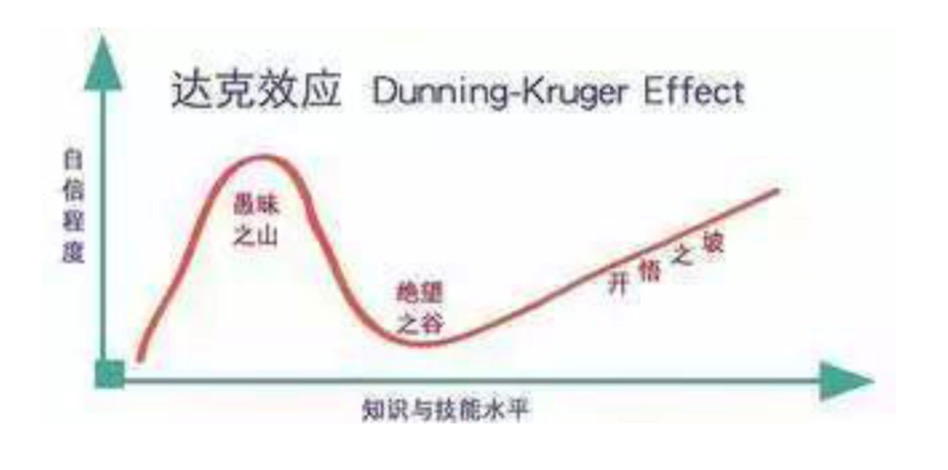

:::tip
疫情期间无法旅行，闲下来翻几本书吧！

人与人的智商差别其实没多大，差别的是思维方式。

1. 关于结构化思维
2. 优秀工程师必备的思维
3. 思考力
4. 成长
5. 自我学习
6. 推荐几本书

   :::

<!-- more -->

## 技术人具备的结构化思维

### 什么是结构化思维

> 简单来说：逻辑+套路。逻辑是一种能力，而套路是方法论，是经验。逻辑是道的东西，而方法论是术的东西。二者都很重要，只有熟练的掌握二者我们才能更好的进行结构化思考。

- 表达要有逻辑

  > 所谓逻辑就是指我们结构之间必须有逻辑关系

  - 演绎(因果)顺序
    如：大前提，小前提，结论
  - 时间(步骤)顺序
    如：第一，第二，第三... 首先，然后，再者... (也会是因果顺序)
  - 空间(结构)顺序
    如：前端，后端，数据 —— 化整为零
  - 程度(重要性)顺序
    如：最重要，次重要，不重要..

- 做事要有套路

  > 套路就是方法论

  - 如：5W2H 分析法（Why、Who、When、Where、What、How 和 How much）,优于点状思考
    

  - 更多方法论...

### 如何进行结构化思考

- 建立中心

  > 建立中心就是定义清楚问题，明确目标。顶层节点，以始为终的思考方式（why->how）。中心不会一次成型，后面对问题的理解深入也会变.

  **怎么做呢？**

  - 自下而上
    适用于问题比较明确的情况，主要找到核心要素就可以，然后展开

  - 自上而下
    对于问题不够明确的情况，需要对多种杂乱的内容，进行分类、剪枝、归纳汇总成一个中心

  如图：

- 结构化分解
  > 确定完中心，需要从逻辑层面进行分解. 遵从 MECE(Mutually Exclusive Collectively Exhaustive，相互独立，完全穷尽)原则

### 结构化思维运用

> 从案例出发

- 问题：如何落地新团队？
  **分析：**对于一个新的公司，核心要素有三个业务，技术，人。从这三个点建立中心。基于这三个点，进行拆分，制定策略。

  - 熟悉业务

    - 了解产品——测试号体验
    - 了解业务流程 —— 信息流
    - 客户走访——贴近需求

  - 熟悉技术

    - 了解系统架构:可以让团队的技术人员介绍下他们当初系统设计和架构的思路。
    - 了解领域模型:查看关键的核心表结构和系统 API，这样可以快速了解系统的领域模型。
    - 了解代码结构:下载系统工程，熟悉整个工程结构和模块职责。以一个最重要的流程为入手点，阅读代码，看清楚核心的执行逻辑。做一个小需求，掌握相关的流 程和权限。

  - 熟悉人

    - 组织结构
    - 人员角色
    - 拜山头:工作相关的人多交流

- 问题：晋升述职？

  - 罗列事情

    > 对自己做过的事情进行简单罗列，也许你的确做了不少事情。但是不能体现你对 问题思考的深度和做这个事情带来的价值。

    **结构化表达：**提出问题，定义问题，分析问题，解决问题，最后是展望未来。

    

    **还有什么框架？**
    如：zoom in/zoom out。说事情时，应该像电影镜头一样，先 从远拉近，再由近拉远。zoom in 是先从宏观背景开始，首先让大家知道你的事情发 生的背景，为什么这事重要?然后讲到具体细节，怎么做成的?解决了什么问题?背 后的思考是什么?最后 Zoom out，再从细节调回到整体，结果是什么，带来的客户 价值是什么，你对未来的思考是什么。

- 价值的背后

  > 把你做事的价值说清楚。同时思考为什么前后有差距的原因。

## 优秀工程师必备的思维

 

**问题：**
产品会做减法吗？

## 优秀工程师必备的技能 - 思考力

> 来自程序员的普遍问题：学的比别人慢？排查问题慢？方案总是有漏洞？认为自己做的事情没有技术含量？同样的错误？...

**“思考力”是程序员需要具备的一种至关重要的素质。**

### 关于思考力

> 思考力是一门很深的学问，包括认知科学，心理学、教育学、逻辑学，如果要系统化学习，是需要看很多书的，
> **推荐书籍：**

1. 《金字塔原理:思考、表达和解决问题的逻辑》-[ 美 ] 芭芭拉·明托，这本书系统阐述了思考、表达和解决问题的逻辑，也是麦肯锡的思维能力基础，算是一本比较标准的思考力教材;

2. 《麦肯锡教我的思考武器》- [ 日 ] 安宅和人，作者根据自己在麦肯锡公司工作时积累的丰富经验以及脑神经学的专业背景，设计出一套极具逻辑性的问题解决思维 模式;

3. 《思维的本质》-[ 美 ] 约翰·杜威 ，这本书是美国著名教育家约翰·杜威的代 表作，阐述了思维训练的基础理论和实践;

### 对程序员最重要的思考力

- 原理性思维:找出知识背后的原理

  **问题：**很多时候会说，我只要掌握知识会用就行了？
  **分析：**掌握原理，可以迁移复用，可以举一反三。知识是爆炸的，原理是可控的。

- 结构化思维：构建自己的知识树

  > 索引没有建立，也就是知识只有点，没有线，面。
  > 做什么事都是有一个明确的分析和执行逻辑。

  - 工作场景结构化
    熟悉一个新系统？新需求的执行方案？...

  - 如何训练自己的知识树？
    1. 一定要总结出自己的知识树，而不要盲从书本上的或者别人的(为什么？每个人的思维速度，习惯，技能有差异)
    2. 习惯总结 —— 做完总结，往自己的知识树上挂一个
    3. 工具记录树 xmind,mindmanager...
    4. 训练自己的思维习惯和做事方式变得结构化 —— 强行用树的方式推进

- 扩展性思维:举一反三，拓展思维

  > 扩展性思维的核心目标是提升我们思维的**广度,深度**

  - 举一反三:解决同类型的 N 个问题,抓住共性，触类旁通批处理
  - 寻求更多的可能性:拓展解决问题的不同手段
    - 产生故障的时候，快速止血除了回滚以外,还有系统降级，活动降级...
    - 提升容错？健壮性代码，数据监控，单闭环....
    - ...

- 抓重点思维:**提升效率**，方便记忆和传递

  **问题：**每件事情都结构树，效率低？对外沟通，讲重点？
  **解决：** 核心思路是要抓住重点和脉络。

  > 一定要 先建立知识结构化，然后才能从里面筛选出重点.

  - 归纳法
    采用归纳法，把细节隐藏掉，呈现知识的脉络，这是一种非常好的思路;尤其是大家在准备晋升 ppt 时，ppt 的每一页都需要归纳一个核心观点，不是全是细节，这 个非常重要!

  - 优先级法
    优先级策略往往应用于在多项任务之间找到最最关键或者收益最大的那个任务项

- 反思性思维:思考哪里可以做得更好
  **提升认知，知识重构**

  > 反思性思维是提升知识质量和深度的一个关键能力。因为只有不断反思才能让下一次在上一次基础上升级，而不是重复循环。

  **实践关键点：**

  1. 反思性思维最重要的意识:做事情的过程总有优化的空间，每次都要有进步;如果没有这种心态，那么很难持续地进行反思;
  2. 反思是一种习惯和潜意识，可以在不经意之间经常进行，其实不需要很形式化地花很多时间，有时候做完一个事情，习惯性思考一下就可以。

### 锻炼思考力的有效实践

- 意识觉醒

- 保持信心

- 空杯心态
  思考的过程其实是对人的知识进行不断刷新和重构的过程，这里一定要保证空 杯心态，对新的环境，新的理念，新的技术持开放态度，否则就是自己给自己制造 阻力。

- 时间哪里来？
  **利用碎片时间，抓住工作过程**

- 提升有没有判断标准？
  **广度，深度，速度**

- 工具

- 分享 (思考是智力活动，1+1>2)

## 工作中快速成长技巧

> 认知升级？一听就是鸡汤软文，道理谁都懂,但依然过不好这一生。但换种喝鸡汤的方式，去体会他？

**认知升级是连接，连接优秀的思维方式，连接解决问题的最短路径，连接一切优秀的方法。**

### 思考脑和反射脑

> **划重点:所谓直觉反射就是通过大量的逻辑反复训练，提升自己的直觉准确性， 从狭窄的 5% 进入广阔的 95%;**

### 习以为常

> **划重点:所谓改变习惯就是在触发条件发生进入下一个行为时，让自己做对选择题。**
> 精英之所以精英，是不间断的正向行为习惯的驱使

### 时间管理：三八论

> **划重点:所谓时间管理就是找到不被打扰的时间用于投资自己的成长。**

### 注意力

> **划重点:所谓提升注意力就是专注在目标事务上，直到产出预期的结果。**

### 拿结果手段：执行力

提升执行力，首先让自己成为投资者，投资自己的成长，投资在正确的事情上， 此时去认知执行力才有意义，我对执行力的认知:“想明白，然后一步一步做下去”， 如果想不明白，根本谈不上执行力。同时提升执行力的时候，还需要自律，通过自律让执行力得到持续，要相信持续投资自己的成长，可以实现“慢慢来，成长最快”的复利效果。

> **划重点:执行力就是想明白，然后一步一步做下去。**内化成自己的认知。

### 贵人

> 感恩环境里，身边帮助或者改变你的人。
> 向别人求助**不等于**麻烦别人.这个是有巨大意义的交易。

> **划重点:贵人就是可以持续陪你输出高质量的人。**

### 会议

输出倒逼输入。

> **划重点:参与会议讨论就是在模拟机器学习，通过正反馈来优化自己的逻辑和观点。**

### 跳出舒适区

> **划重点:跳出舒适区就是进入学习区，平衡挑战和技能从而达到心流体验**

### 职业规划

> **划重点:所谓职业规划，就是工作能力提升**

### 时间换空间

> 所谓时间换空间，就是让我们无法看清未来是什么样子的时候，把注意力聚焦在 当下，做成长该做的事。

> **划重点:所谓时间换空间，就是慢慢来，持之以恒，成长最快。**

### 总结：

- 所谓直觉反射，就是通过大量的逻辑反复训练，提升自己的直觉准确性，从狭窄的 5% 进入广阔的 95%;

- 所谓以习为常，就是在触发条件发生进入下一个行为前，做对选择题;

- 所谓时间管理，就是找到不被打扰的时间用于投资自己;

- 所谓注意力，就是专注在目标事务上，直到产生期望结果;

- 所谓执行力，就是让自己先想明白，然后一步一步走下去;

- 所谓贵人，就是能够持续陪你一起输出高质量内容的人;

- 所谓会议，就是模拟机器学习思路，通过参与讨论获得正反馈来验证自己的观点;

- 所谓跳出舒适区，就是先跳出，然后进入学习区，平衡挑战和能力达到心流的体验;

- 所谓职业规划，就是提升工作需要的能力; 所谓时间换空间，就是慢慢来，持之以恒，成长最快;

## 技术规划、管理、架构

## 自我学习

视频，论坛，文档，订阅专栏。
做项目，写 demo,看源码。

## 感悟

- 一个人走的快，一群人走的远

- 当你不舒服，难受或陷于困境时，应该停下来思考

- 学习能力与思维模式是一个人的核心竞争力

  - 承认自己的不足 —— 付出努力

  - 掌握优秀的学习方法 —— 学习做到目到，口到，心到。

  - 掌握搜索信息的有效方式

    **如何高效获取信息，分析信息是 非常重要的能力。相对常规的模式是:当你发现问题，定义出问题，就去搜索业界最 优秀的解决方案，并且花时间研究方案，了解原理，最后不断地学习实践。**
    **如何提升获取的信息质量?建议:**

    - 精确定位问题
    - 梳理出关键字与概念
    - “全网”搜索
    - 分析研究
    - 实践&结论&假设

  - 具备优秀的批判性思维模型
    对思维的水平分了三个层次:较差、中等、最佳 水平的思考。当前很多同学可能在多数问题上都处于较差水平层次，很多 认知来自直觉或者自我视角。最佳水平的思考要做到三点:全局、公正、客观。

    

    

## 优秀的 TL

### 开发规范

- 命名规范
- 统一 IDE 代码模板
- Maven 使用规范
- 代码 Commit 规范
- 统一 API 规范
- 异常处理规范

  - 直接返回
  - 抛出异常
  - 重试处理
  - 熔断处理
  - 降级处理

- 分支开发规范

  - 分支的定义(master、develop、release、hotfix、feature)
  - 分支命名规范
  - checkout、merge request 流程
  - 提测流程
  - 上线流程
  - Hotfix 流程

- 统一日志规范
- 统一工具与框架

### 开发流程

> 整体开发流程涉及需求评审、测试用例评审、技术架构评审、开发与测试、验收与上线..

- 需求管理
- 技术架构评审

  **核心：**

  1. 设计把关，确保方案合格，各方面都考虑到了，避免缺陷和遗漏，不求方案 多牛，至少不犯错。
  2. 保证架构设计合理和基本一致，符合整体原则。
  3. 维持对系统架构的全局认知，避免黑盒效应。
  4. 通过评审发掘创新亮点，推广最佳实践。

  > 架构设计既要保证架构设计的合理性和可扩展性，又要避免过度设计。架构设计 不仅仅是考虑功能实现，还有很多非功能需求，以及持续运维所需要的工作，需要工 程实践经验，进行平衡和取舍。

  **要点：**

  1. 技术选型
  2. 高性能
  3. 高可用
  4. 可扩展
  5. 可伸缩
  6. 弹性处理
  7. 兼容性
  8. 安全性
  9. 可测性
  10. 可维护性
  11. 监控与报警

- 代码审查

  1. 确认代码功能:满足需求,严谨、合理、可扩展
  2. 编码规范
  3. 潜在 bug(逻辑，边界，参数,安全)
  4. 代码注释（过少，过多，过时）
  5. 重复代码
  6. 复杂度
  7. 监控与报警
  8. 测试覆盖率(单元测试)

- 发布计划评审

  1. 明确是否有外部依赖接口，如有请同步协调好业务方;
  2. 发布前配置确认包括配置文件、数据库配置、中间件配置等各种配置，尤其各种环境下的差异化配置项;
  3. 二方库发布顺序，是否有依赖;
  4. 应用发布顺序;
  5. 数据库是否有数据变更和订正，以及表结构调整;
  6. 回滚计划，必须要有回滚计划，发布出现问题要有紧急回滚策略;
  7. 生产环境回归测试重点 Case。

### 技术规划与管理

- 系统健康度巡检

  - 系统指标:系统 CPU、负载、内存、网络、磁盘有无异常情况波动，确认是 否由发布导致，还是系统调用异常。
  - 慢接口:通常 rt 大于 3s 的接口需要重点关注，极端并发场景下容易导致整个 系统雪崩。
  - 慢查询:MYSQL 慢查询需要重点关注，随着数据量上涨，需要对慢查询进行 优化。
  - 错误日志:通过错误日志去发现系统隐藏的一些 bug，避免这些 bug 被放大， 甚至极端情况下会导致故障。

- 技术规划

  - 架构优化:一些结构不良、低内聚高耦合的代码则会使得哪怕是微小的需求变 更或功能扩展都无从下手，修改的代价很可能超过了重写的代价。同样系统之 间的耦合也需要重点去关注，遵循微服务化的原则，系统也要遵循单一职责原则，对于职责不清晰的系统去做解耦优化，进行一些模块化改造、服务隔离、 公用服务抽象。

  - 性能优化:基于财年对于业务量、数据量的发展评估，根据目前系统服务的 QPS\RT, 需要提前规划对系统性能进行一些升级策略，包括重点关注对一些 慢接口、慢查询的优化。

  - 弹性与可靠性:系统提供的服务需要保障括数据一致性、幂等、防重攻击， 同时也需要从熔断降级、异地多活的角度去考虑存在哪些问题，目前系统的 SLA 指标是否能够达到高可用，需要做哪些优化保障系统的高可用。

  - 可伸缩:应用服务是否保证无状态，关键节点发生故障能够快速转移、扩容， 避免故障扩大化。

**自我认知的偏见**

心理学上有个著名的邓宁 - 克鲁格效应，又称达克效应。大意是，人很容易对自 我产生认知偏差，最简单来说，就是会过于高估自己。达克效应的曲线图:
