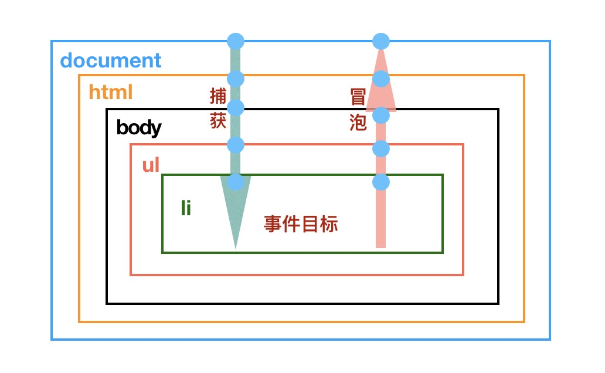
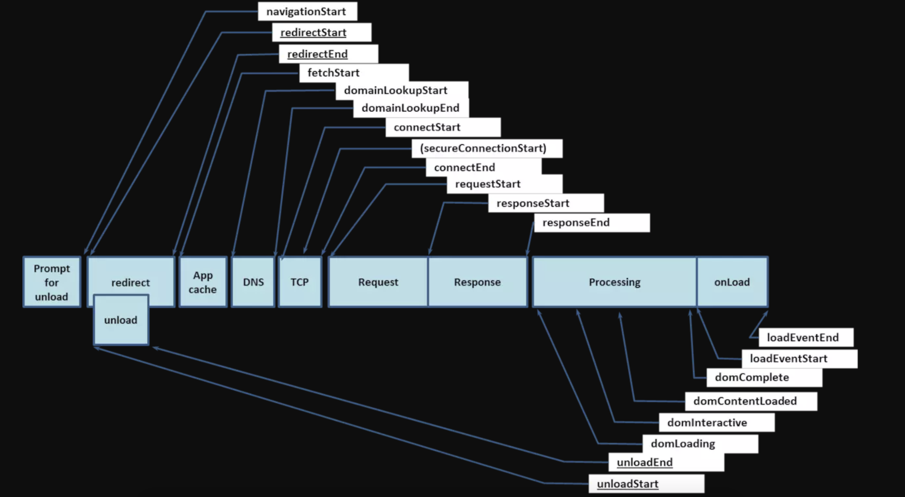
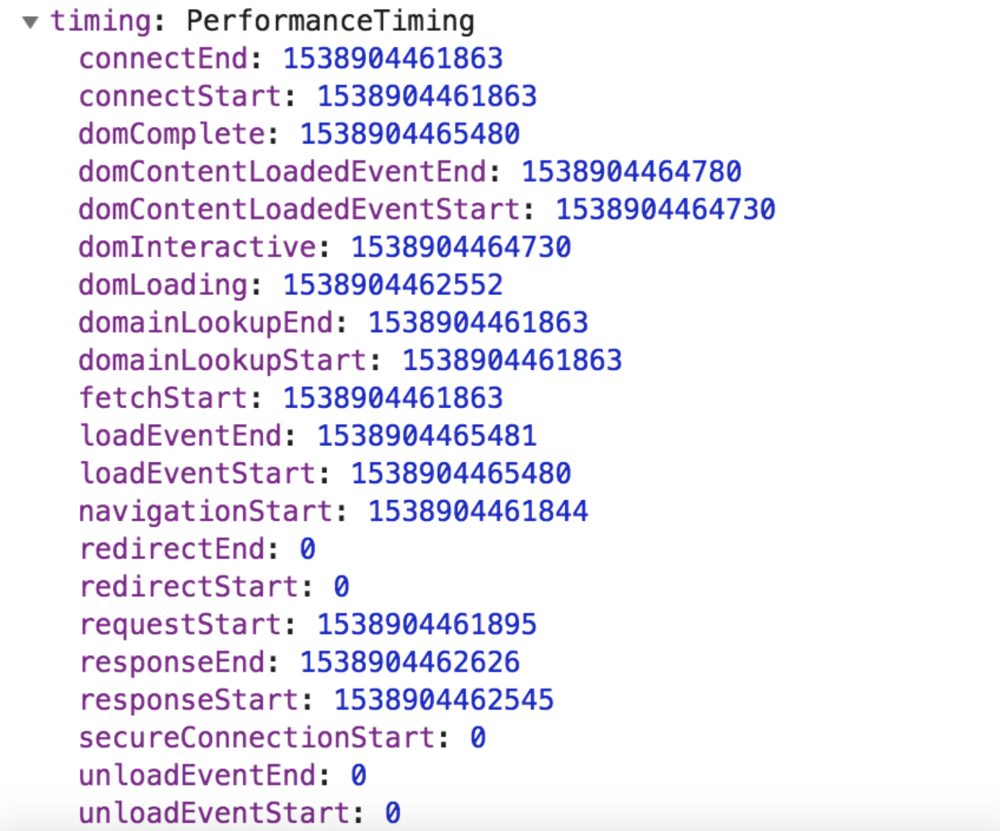

:::tip

1. 事件代理
2. 性能监测
   :::

<!-- more -->

## 事件代理机制

> 在说浏览器事件代理机制原理之前，我们首先了解一下事件流的概念，早期浏览器，IE 采用的是事件捕获事件流，而 Netscape 采用的则是事件捕获。"DOM2 级事件"把事件流分为三个阶段，捕获阶段、目标阶段、冒泡阶段。现代浏览器也都遵循此规范。



**那么事件代理是什么呢？**

    事件代理又称为事件委托，在祖先级DOM元素绑定一个事件，当触发子孙级DOM元素的事件时，利用事件冒泡的原理来触发绑定在祖先级DOM的事件。因为事件会从目标元素一层层冒泡至document对象。

**为什么要事件代理？**

- 添加到页面上的事件数量会影响页面的运行性能，如果添加的事件过多，会导致网页的性能下降。采用事件代理的方式，可以大大减少注册事件的个数。
- 事件代理的当时，某个子孙元素是动态增加的，不需要再次对其进行事件绑定。
- 不用担心某个注册了事件的 DOM 元素被移除后，可能无法回收其事件处理程序，我们只要把事件处理程序委托给更高层级的元素，就可以避免此问题。

**如将页面中的所有 click 事件都代理到 document 上?**

```js
// addEventListener 接受3个参数，分别是要处理的事件名、处理事件程序的函数和一个布尔值。布尔值默认为false。表示冒泡阶段调用事件处理程序，若设置为true，表示在捕获阶段调用事件处理程序。

document.addEventListener("click", function(e) {
  console.log(e.target)
  /**
   * 捕获阶段调用调用事件处理程序，eventPhase是 1;
   * 处于目标，eventPhase是2
   * 冒泡阶段调用事件处理程序，eventPhase是 1；
   */
  console.log(e.eventPhase)
})
```

> 第三个参数也接收一个对象

`{capture:false ,once:true ,passive:true}`

- capture：该类型的事件冒泡阶段触发，
- once：添加之后最多只调用一次，
- passive：表示永远不会调用 preventDefault()。

并且不同的事件处理程序的 passive 的默认是不一样的。
在移动端的 touchmove 事件中 passive 值默认为 true，如果要在移动端中阻止滚动的话，要手动将 passive 设置为 false。

## dev-tool 性能监测

> 性能监测是前端性能优化的重要一环。监测方案：可视化方案、可编程方案。

### 可视化监测 —— Performance 面板

当我们选中图中所标示的实心圆按钮，Performance 会开始帮我们记录我们后续的交互操作；
当我们选中圆箭头按钮，Performance 会将页面重新加载，计算加载过程中的性能表现。

**tips**:使用 Performance 工具时，为了规避其它 Chrome 插件对页面的性能影响，我们最好在无痕模式

**FPS**:这是一个和动画性能密切相关的指标，它表示每一秒的帧数。图中绿色柱状越高表示帧率越高，体验就越流畅。若出现红色块，则代表长时间帧，很可能会出现卡顿。图中以绿色为主，偶尔出现红块，说明网页性能并不糟糕，但仍有可优化的空间。

**CPU**:表示 CPU 的使用情况，不同的颜色片段代表着消耗 CPU 资源的不同事件类型。这部分的图像和下文详情面板中的 Summary 内容有对应关系，我们可以结合这两者挖掘性能瓶颈。

**NET**:粗略的展示了各请求的耗时与前后顺序。这个指标一般来说帮助不大。

1. 先看 CPU 图表和 Summary 饼图。CPU 图表中，我们可以根据颜色填充的饱满程度，确定 CPU 的忙闲，进而了解该页面的总的任务量。而 Summary 饼图则以一种直观的方式告诉了我们，哪个类型的任务最耗时（从本例来看是脚本执行过程）。这样我们在优化的时候，就可以抓到“主要矛盾”，进而有的放矢地开展后续的工作了。
2. 再看 Main 提供给我们的火焰图。这个火焰图非常关键，它展示了整个运行时主进程所做的每一件事情（包括加载、脚本运行、渲染、布局、绘制等）。x 轴表示随时间的记录。每个长条就代表一个活动。更宽的条形意味着事件需要更长时间。y 轴表示调用堆栈，我们可以看到事件是相互堆叠的，上层的事件触发了下层的事件。
3. CPU 图标和 Summary 图都是按照“类型”给我们提供性能信息，而 Main 火焰图则将粒度细化到了每一个函数的调用。到底是从哪个过程开始出问题、是哪个函数拖了后腿、又是哪个事件触发了这个函数，这些具体的、细致的问题都将在 Main 火焰图中得到解答。

### 可视化监测： 更加聪明的 LightHouse

Lighthouse 是一个开源的自动化工具，用于改进网络应用的质量。 你可以将其作为一个 Chrome 扩展程序运行，或从命令行运行。 为 Lighthouse 提供一个需要审查的网址，它将针对此页面运行一连串的测试，然后生成一个有关页面性能的报告。

- chrome 商店下载 LightHouse
- 直接下载
  `npm install -g lighthouse lighthouse https://juejin.im/books`

### 可编程的性能上报方案： W3C 性能 API

访问 performance 对象：performance 是一个全局对象。我们在控制台里输入 window.performance

- 关键时间点：在 performance 的 timing 属性中，我们可以查看到如下的时间戳
  

- 这些时间戳与页面整个加载流程中的关键时间节点有着一一对应的关系：
  

**关键性能指标：firstbyte、fpt、tti、ready 和 load 时间**

```
// firstbyte：首包时间
timing.responseStart – timing.domainLookupStart

// fpt：First Paint Time, 首次渲染时间 / 白屏时间
timing.responseEnd – timing.fetchStart

// tti：Time to Interact，首次可交互时间
timing.domInteractive – timing.fetchStart

// ready：HTML 加载完成时间，即 DOM 就位的时间
timing.domContentLoaded – timing.fetchStart

// load：页面完全加载时间
timing.loadEventStart – timing.fetchStart
```

_通过访问 performance 的 memory 属性，我们还可以获取到内存占用相关的数据。_
