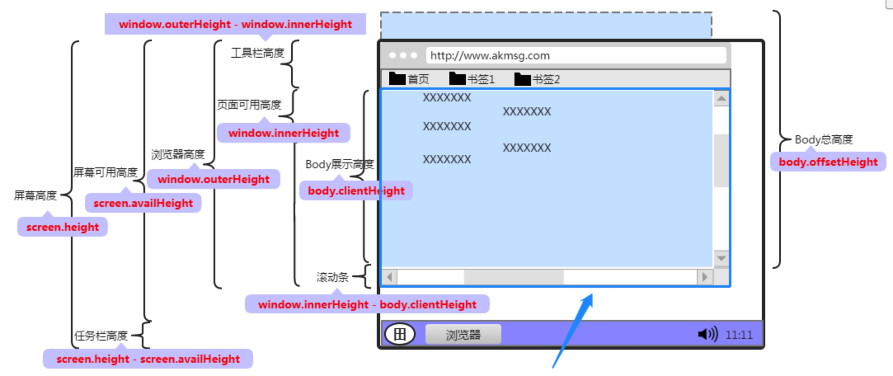
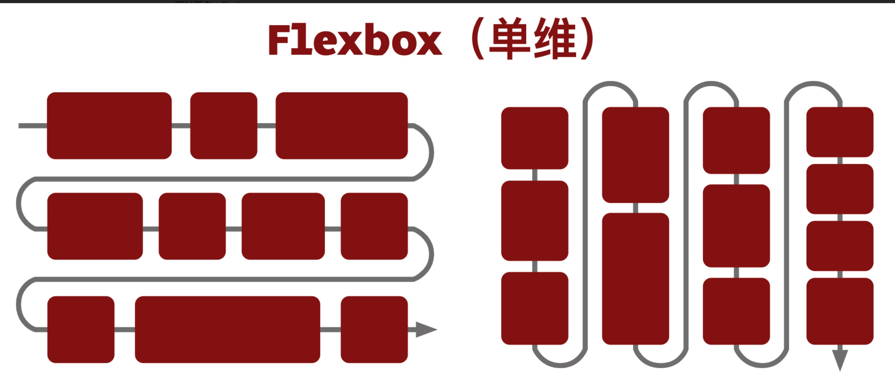
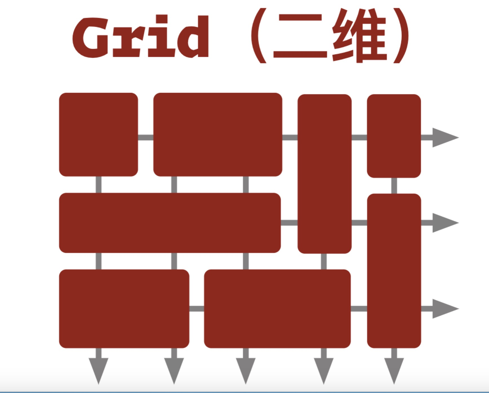

h5 开发，调试，适配

<!-- more -->

### 响应式页面的四个层次

- 同一页面再不同大小和比例上看起来应该是舒适的
- ...不同分辨率上看起来是合理的
- ...不同操作方式下，体验统一
- ...不同类型设备上，交互方式符合习惯

### 基本原则

**1、可伸缩的内容区块**：内容区块的在一定程度上能够自动调整，以确保填满整个页面

**2、可自由排布的内容区块**：当页面尺寸变动较大时，能够减少/增加排布的列数

**3、适应页面尺寸的边距**：到页面尺寸发生更大变化时，区块的边距也应该变化

**4、能够适应比例变化的图片**：对于常见的宽度调整，图片在隐去两侧部分时，依旧保持美观可用

**5、能够自动隐藏/部分显示的内容**：如在电脑上显示的的大段描述文本，在手机上就只能少量显示或全部隐藏

**6、能自动折叠的导航和菜单**：展开还是收起，应该根据页面尺寸来判断

**7、放弃使用像素作为尺寸单位**：用 dp 尺寸等方法来确保页面在分辨率相差很大的设备上，看起来也能保持一致。同时也要求提供的图片应该比预想的更大，才能适应高分辨率的屏幕。

**总结**

- 媒体查询，边界断点的规则设定（Media queries && break point）

- 内容的可伸缩性效果（Flexibel visuals）

- 流式网格布局(Fluid grids)

- 主要内容呈现及图片的高质量(Main content and high quality)

## 移动端适配

### 概念

- **设备独立像素（dip）**

  **设备独立像素 = CSS 像素 = 逻辑像素**

  我们设定一个宽度为 375px 的 div，刚好可以充满这个设备的一行，配合高度 667px ，则 div 的大小**刚好**可以充满整个屏幕。

* **物理像素**

  屏幕实际的分辨率（设备参数）。

  又称，设备像素。显示屏是由一个个物理像素点组成的，`1334 x 750` 表示手机分别在垂直和水平上所具有的像素点数。通过控制点的颜色显示不同的图像。

  固定不变，单位：pt

  _设备像素 = 物理像素_

* **设备像素比**（dpr）

  ​ 牵涉到多倍屏。

  **DPR = 物理像素 / 设备独立像素**

​ **总结**

​ 1、适配不同屏幕大小，也就是适配不同屏幕下的 CSS 像素

​ 2、适配不同像素密度，也就是适配不同屏幕下 dpr 不一致导致的一些问题

### 适配不同屏幕大小

#### 百分比适配

按比例还原设计稿，但是百分比需要有个参考对象。缺少一个全局基准单位

- 宽度（width）、间距（maring/padding）支持百分比值，但默认的相对参考值是包含块的宽度；
- 高度（height）百分比的大小是相对其父级元素高的大小；
- 边框（border）不支持百分值；

- 边框圆角半径（border-radius）支持百分比值，但水平方向相对参考值是盒子的宽度，垂直方向相对参考值是盒子的高度；

- 文本大小（font-size）支持百分比值，但相对参考值是父元素的 font-size 的值；

- 盒阴影（box-shadow）和文本阴影（text-shadow）不支持百分比值；

#### rem 适配

> em 是根据其父元素的字体大小来设置，而 rem 是根据网页的根元素（html）来设置字体大小。作为全局性的基准单位。

**flexible**

基于此，淘宝早年推行的一套以 rem 为基准的适配方案：[lib-flexible](https://github.com/amfe/lib-flexible)。核心做法：

- <del>根据设备的 dpr 动态改写 `` 标签，设置 viewport 的缩放</del>

- <del>给 `` 元素添加 data-dpr 属性，并且动态改写 data-dpr 的值</del>

- 根据 `document.documentElement.clientWidth` 动态修改 `` 的 font-size ，页面其他元素使用 rem 作为长度单位进行布局，从而实现页面的等比缩放

> 关于头两点，其实现在的 `lib-flexible` 库已经不这样做了，不再去缩放 Viewport，字体大小的设定也直接使用了 rem

**hotcss**

[hotcss](https://github.com/imochen/hotcss) 。移动端适配解决方案，本质的思想与 flexible 完全一致。

**rem 方案总结：**（存在问题）

- 动态修改 Viewport 存在一定的风险的，譬如通过 Viewport 改变了页面的缩放之后，获取到的 `innerWidth/innerHeight` 也会随之发生变化，如果业务逻辑有获取此类高宽进行其他计算的，可能会导致意想不到的错误；

  > 到今天，其实存在很多在 flexible 基础上演化而来的各种 rem 解决方案，有的不会对 Viewport 进行缩放处理，自行处理 1px 边框问题。

- flexible/hotcss 都并非纯 CSS 方案，需要引入一定的 Javascript 代码
- rem 的设计初衷并非是用于解决此类问题，用 rem 进行页面的宽度适配多少有一种 hack 的感觉

- 存在一定的兼容性问题，对于安卓 4.4 以下版本系统不支持 viewport 缩放（当然，flexible 处理 Android 系列时，始终认为其 dpr 为 1，没有进行 viewport 缩放）

#### vm 适配方案

> 百分比适配方案的核心需要一个全局通用的基准单位，rem 是不错，但是需要借助 Javascript 进行动态修改根元素的 `font-size`，而 vw/vh（vmax/vmin） 的出现则很好弥补 rem 需要 JS 辅助的缺点。

- `1vw` 等于 `window.innerWidth` 的数值的 1%

- `1vh` 等于`window.innerHeight` 的数值的 1%

  

- 元素的宽度为：`209/375 = 55.73% = 55.73vw`

- 元素的高度为：`80/375 = 21.33% = 21.33vw`

- 元素的上左右边距依次计算...

根据相关的测试，可以使用 vw 进行长度单位的有：

- 容器大小适配，可以使用 vw
- 文本大小的适配，可以使用 vw
- 大于 1px 的边框、圆角、阴影都可以使用 vw
- 内距和外距，可以使用 vw

**转换插件**

当我们使用 rem 作为长度单位的时，通常会有借助 Sass/Less 实现一个转换函数，像是这样：

```css
// 假设设计稿的宽度是 375px，假设取设计稿宽度下 1rem = 100px
$baseFontSize: 100;

@function px2rem($px) {
  @return $px / $baseFontSize * 1rem;
}
```

同理，在 vw 方案下，我们只需要去改写这个方法：

```css
// 假设设计稿的宽度是 375px

@function px2vw($px) {
  @return $px / 375 * 100vw;
}
```

**移动端适配神器插件包：[postcss-px-to-viewport](https://www.npmjs.com/package/postcss-px-to-viewport)**

注意考虑第三方库的兼容性问题，参考 git 文档

**兼容性降级处理：**

- CSS Houdini：通过 CSS Houdini 针对 vw 做处理，调用 CSS Typed OM Level1 提供的 CSSUnitValue API。

- CSS Polyfill：通过相应的 Polyfill 做相应的处理，目前针对于 vw 单位的 Polyfill 主要有：vminpoly、Viewport Units Buggyfill、vunits.js 和 Modernizr

**方案总结：**

vw 确实看上去很不错，但是也是存在它的一些问题：

1. 也没能很好的解决 1px 边框在高清屏下的显示问题，需要自行处理
2. 由于 vw 方案是完全的等比缩放，在完全等比还原设计稿的同时带来的一个问题是无法很好的限定一个最大最小宽度值，由于 rem 方案是借助 Javascript 的，所以这一点 rem 比 vw 会更加的灵活

- [Responsive And Fluid Typography With vh And vw Units](https://www.smashingmagazine.com/2016/05/fluid-typography/)
- [使用 VH 和 VW 实现真正的流体排版](https://www.cnblogs.com/wengxuesong/archive/2016/05/16/5497653.html)

### 图片适配及优化

手段：

1. 消除多余的图像资源
2. **尽可能利用 CSS3\SVG 矢量图像替代某些光栅图像**
3. 谨慎使用字体图标，使用网页字体取代在图像中进行文本编码
4. 选择正确的图片格式
5. **为不同 DPR 屏幕提供最适合的图片尺寸**

#### 无脑多倍图

在移动端假设我们需要一张 CSS 像素为 `300 x 200` 的图像，考虑到现在已经有了 dpr = 3 的设备，那么要保证图片在 dpr = 3 的设备下也正常高清展示，我们最大可能需要一张 `900 x 600` 的原图。

这样，不管设备的 dpr 是否为 3，我们统一都使用 3 倍图。这样即使在 dpr = 1，dpr = 2 的设备上，也能非常好的展示图片。

当然这样并不可取，会造成大量带宽的浪费。现代浏览器，提供了更好的方式，让我们能够根据设备 dpr 的不同，提供不同尺寸的图片。

- srcset 配合 1x 2x 像素密度描述符

- srcset 属性配合 sizes 属性 w 宽度描述符

**细节：**

Google Web Fundamentals -- Web Responsive Images](https://developers.google.com/web/fundamentals/design-and-ux/responsive/images)

响应式图片 srcset 全新释义 sizes 属性 w 描述符](https://www.zhangxinxu.com/wordpress/2014/10/responsive-images-srcset-size-w-descriptor/)

### 字体的适配

首先要知道，浏览器有最小字体限制：

- PC 上最小 font-size=12px
- 手机上最小 font-size=8px

> 小于最小字体就是默认字体。建议不要使用奇数级单位来定义字体大小（如 13px，15px...），容易在一些低端设备上造成字体模糊，出现锯齿。

**_性能和展示效果两个方面谈一下字体的适配_**

完整的字体资源很大，加载需要时间，尽量使用设备上已有的字体。使用各个平台上的默认系统字体。

[CSS-Trick](https://css-tricks.com/)

```css
 {
  font-family: system-ui, -apple-system, BlinkMacSystemFont, segoe ui, Roboto,
    Helvetica, Arial, sans-serif, apple color emoji, segoe ui emoji,
    segoe ui symbol;
}
```

### 页面布局的兼容适配

**布局发展历程**

> **表格布局 --> 定位布局 --> 浮动布局 --> flexbox 布局 --> gridbox 布局**

- Flexbox

  display:flex

- CSS Grid Layout

  > flexbox 是一维布局，他只能在一条直线上放置你的内容区块；而 grid 是一个二维布局。它除了可以灵活的控制水平方向之外，还能轻易的控制垂直方向的布局模式。对于上图那样的九宫格布局，它就可以轻而易举的完成。

  

  

[新时代 CSS 布局](https://www.chenhuijing.com/slides/53-cssconfcn-2019/#/)

​

## 移动端兼容

#### 1px 线。

设计师想要的 retina 下 `border: 1px`，其实是 1 物理像素宽，而不是 1 CSS 像素宽度，对于 CSS 而言：

- 在 dpr = 1 时，此时 1 物理像素等于 1 CSS 像素宽度；
- 在 dpr = 2 时，此时 1 物理像素等于 0.5 CSS 宽度像素，可以认为 `border-width: 1px` 这里的 1px 其实是 1 CSS 像素宽度，等于 2 像素物理宽度，设计师其实想要的是 `border-width: 0.5px`;
- 在 dpr = 3 时，此时 1 物理像素等于 0.33 CSS 宽度像素，设计师其实想要的是 border: 0.333px

然而，并不是所有手机浏览器都能识别 `border-width: 0.5px`，在 iOS7 以下，Android 等其他系统里，小于 1px 的单位会被当成为 0px 处理，那么如何实现这 0.5px、0.33px 呢？

这里介绍几种方法：

- 渐变实现
- 使用缩放实现
- 使用图片实现（base64）
- 使用 SVG 实现（嵌入 background url）

[Retina 屏幕下 1px 线的实现](https://codepen.io/Chokcoco/pen/XyNjqK)

#### tips

- iso 对'2019-09-10 13:33:00' new Date() 是不是识别，**需要改为 '2019/09/10 12:33:00'**

- vue 项目中，部分机型 img 图片不能出来，**使用 background 代替**

- ios 下 input 为 type=button 属性 disabled 设置 true,会出现样式文字和背景异常问题。

  **使用 opacity=1 来解决**

- 对非可点击元素如(label,span)监听 click 事件，部分 ios 版本下不会触发。

  **css 增加 cursor:pointer**

- 移动端 1px 边框

  ```
  // 按钮的box的class为btn
  .btn:before{
    content:'';
    position: absolute;
    top: 0;
    left: 0;
    border: 1px solid #ccc;
    width: 200%;
    height: 200%;
    box-sizing:border-box;
    -webkit-box-sizing:border-box;
    -webkit-transform: scale(0.5);
    transform: scale(0.5);
    -webkit-transform-origin: left top;
    transform-origin: left top;
  }

  ```

- input 为 fixed 定位，在 ios 下 input 固定定位在顶部或者底部，在页面滚动一些距离后，点击 input(弹出键盘)，input 位置会出现在中间位置。

  **内容列表框也是 fixed 定位,这样不会出现 fixed 错位的问题**

- 移动端字体小于 12px 使用四周边框或者背景色块，部分安卓文字偏上 bug 问题。

  **可以使用整体放大屏幕的 dpr 倍(width、height、font-size 等等)再使用 transform 缩放,使用 canvas 在移动端会模糊也需要这样的解决方案**

- 在移动端图片上传图片兼容低端机的问题。

  **input 加入属性 accept="image/\*" multiple**

- 在 h5 嵌入 app 中，ios 如果出现垂直滚动条时，手指滑动页面滚动之后，滚动很快停下来，好像踩着刹车在开车，有“滚动很吃力”的感觉。

  ```
  self.webView.scrollView.decelerationRate = UIScrollViewDecelerationRateNormal;对webview设置了更低的“减速率”
  ```

- 在安卓机上 placeholder 文字设置行高会偏上

  **input 有 placeholder 情况下不要设置行高**

- overflow:scroll，或者 auto 在 iOS 上滑动卡顿的问题

  **加入-webkit-overflow-scrolling:touch;**

- [移动端图片压缩预览上传问题](https://segmentfault.com/a/1190000006101416)

- 移动端适配可以使用[lib-flexible](https://github.com/amfe/lib-flexible) ，使用 rem 来布局移动端有一个问题就是 px 的小数点的问题，不同的手机对于小数点处理方式不一样，有些是四舍五入，有些直接舍去掉，因此在自动生成雪碧图时候图标四周适当留 2px 的空间，防止图标被裁剪掉

- iphonex 的适配的解决方案

  ```
  <meta name="viewport" content="...,viewport-fit=cover" />
  body{
      padding-top: constant(safe-area-inset-top);
      padding-top: env(safe-area-inset-top);
      padding-bottom: constant(safe-area-inset-bottom);
      padding-bottom: env(safe-area-inset-bottom);
  }
  ```

## 移动端调试

#### vConsole 控制台调试

#### charless 抓包

#### [weinre](https://people.apache.org/~pmuellr/weinre/docs/latest/Home.html)

> 网页检查工具，可以通过在本地启动一个 `weinre` 服务，并向手机网页嵌入一段 `js` 脚本来实现和电脑的通信，已达到类似浏览器开发工具那样的的调试效果

#### `Mac` + `IOS` + `Safari`

第一步：打开苹果手机 `设置` > `Safari浏览器` > `高级` > `Web检查器`

第二步： 打开 `Mac` 上的 `Safari浏览器` > `偏好设置` > `高级` > `在菜单栏中显示“开发”菜单`

第三步： 用数据线连接你的 `Mac` 电脑和苹果手机，并选择信任设备。然后在手机的 `Safari浏览器` 中打开你需要调试的页面，并在电脑上点击下图红框的位置。

## `Chrome浏览器` + `Android`

第一步：打开 `Android` 手机 `设置` > `开发者选项` > `USB调试`。设置里面没有 `开发者选项` 的，自行[百度](https://www.baidu.com/)。

第二步：通过数据线连接你的电脑和 `Android` 手机，会弹出如下界面，点击 `确定`。

第三步：给你的 `Android` 手机下载一个手机版的 `Chrome浏览器` (各大应用商店自行搜索)，并在手机上的 `Chrome浏览器` 中打开你需要调试的页面。

第四步：打开你电脑上的 `Chrome浏览器` ，按下图标注顺序，依次点开。我使用的是 `小米5`，你可以看到左侧有 `MI 5` 已连接的字样。划线的地方分别是手机上 `Chrome浏览器` 和自带浏览器 `WebView` 下打开的页面。

第五步： 每个页面右侧都有一个 `Inspect` 检查的按钮，点击就会出现你熟悉的画面。
