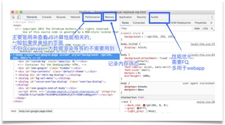
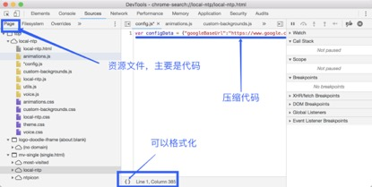
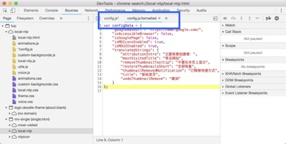
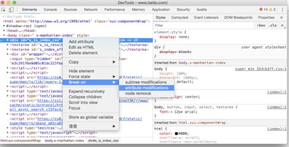
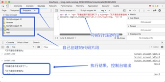
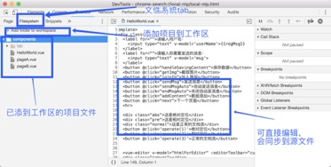
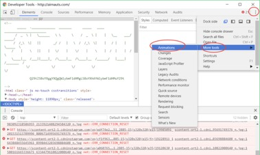
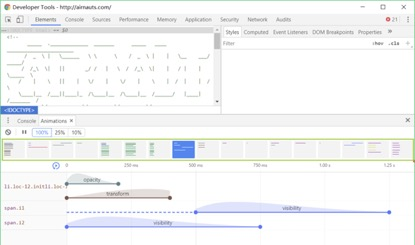
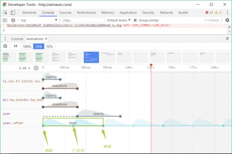

:::tip

1. 基本面板的介绍
2. filesystem 文件系统的使用以及项目中的使用建议
3. Snippets 片段的使用以及项目中的使用建议
4. animation 的调试方法以及项目中的使用建议

:::

<!-- more-->

## Chrome 开发者工具

### 面板的介绍

一张图

1. 一般开发经常用的就略过（element,console）。
2. source 面板

   - page

   
   

   优点：

   1. 可以打断点，便于排查问题。
   2. 增加代码的可读性，阅读别人写的代码。

   **断点调试的简单介绍：**

   1. 右侧最上面一排分别是：暂停/继续、单步执行(F10 快捷键)、单步跳入此执行块(F11 快捷键)、单步跳出此执行块、禁用/启用所有断点。
   2. 在当前的代码执行区域，在调试中如果发现需要修改的地方，也是可以立即修改的，修改后保存即可生效，这样就免去了再到代码中去书写，再刷新回看了
   3. 快速进入调试的方法。当我们的代码执行到某个程序块方法处，这个方法上可能你并没有设置相关的断点，此时你可以 F11 进入此程序块，但是往往我们的项目都是经过很多源代码封装好的方法，有时候进入后，会走很多底层的封装方法，需要很多步骤才能真正进入这个函数块，此时将鼠标放在此函数上，会出现相关提示，会告诉你在该文件的哪一行代码处，点击即可直接看到这个函数，然后临时打上断点，按 F10 或者点击右上角的第二个按钮即可直接进入此函数的断点处。
   4. Call Stack 调用栈：当断点执行到某一程序块处停下来后，右侧调试区的 Call Stack 会显示当前断点所处的方法调用栈，从上到下由最新调用处依次往下排列，Call Stack 列表的下方是 Scope Variables 列表可以查看此时局部变量和全局变量的值。先走到一个方法，然后走到了一个更新对象的方法上，当前调用在哪里，箭头会帮你指向哪里，同时我们可以点击，调用栈列表上的任意一处，即可回头再去看看代码。但是若你想从新从某个调用方法出执行，可以在函数上右键 Restart Frame， 断点就会跳到此处开头重新执行，Scope 中的变量值也会依据代码从新更改，这样就可以回退来从新调试，错过的调试也可以回过头来反复查看。
   5. Breakpoints 关于断点：所有当前 js 的断点都会展示在这个区域，你可以点击按钮用来"去掉/加上"此处断点，也可以点击下方的代码表达式，调到相应的程序代码处，来查看
   6. XHR Breakpoints 在 XHR Breakpoints 处，点击右侧的+号，可以添加请求的 URL，一旦 XHR 调用触发时就会在 request.send() 的地方中断
   7. DOM Breakpoints: 可以给你的 DOM 元素设置断点，有时候真的需要监听和查看某个元素的变化情况，赋值情况，但是我们并是不太关心哪一段代码对它做的修改，只想看看它的变化情况，那么可以给它来个监听事件，这个时候 DOM Breakpoints 中会如图

   

   当要给 DOM 添加断点的时候，会出现选择项分别是如下三种修改

   1. 子节点修改
   2. 自身属性修改
   3. 自身节点被删除。选中之后，Sources Panel 中右侧的 DOM Breakpoints 列表中就会出现该 DOM 断点。一旦执行到要对该 DOM 做相应修改时，代码就会在那里停下来

   4. Event listener Breakpoints 最后 Event Listener 列表，这里列出了各种可能的事件类型。勾选对应的事件类型，当触发了该类型的事件的 JavaScript 代码时就会自动中断
   5. Watch 可以帮你监控执行当前断点所在作用域任何表达式的执行结果，输入 `this.state.name + '`

- Snippets 片段

1. 书写一些自己测试的代码片段
2. 可执行程序中的方法
3. 内容会在控制台输出

- Content snippets

  Content scripts 是 Chrome 的一种扩展程序，它是按照扩展的 ID 来组织的，这些文件也是嵌入在页面中的资源，这类文件可以读写和操作我们的资源，需要调试这些扩展文件，则可以在这个目录下打开相关文件调试，但是几乎我们的项目还没有相关的扩展文件,所以是空的。

- Filesystem

  

- Network 网络请求

- Performance 标签页可以显示 JS 执行时间、页面元素渲染时间
- memory 标签页可以查看 CPU 执行时间与内存占用
- Application 标签页会列出所有的资源，以及 HTML5 的 Database 和 LocalStorage 等，你可以对存储的内容编辑和删除
- Security 标签页 可以告诉你这个网站的安全性，查看有效的证书
- Audits 标签页 可以帮你分析页面性能，有助于优化前端页面，分析后得到的报告

### chrome 动画调试

- 上图绿色标注为动画时间轴缩略图示，点击可以播放动画。速度可控制为 100% =1 倍速、25% =1/4 倍速、10% =1/10 倍速
- 点击动画曲线可以在 Element 中选中元素

上图中最后一个动画，可以看到这是一个循环动画，起始深色部分为一个周期，空心部分为 关键帧 ，我们可以拖动红色时间轴进行动画预览。结合实际情况使用以上方法，可以快速调节动画
